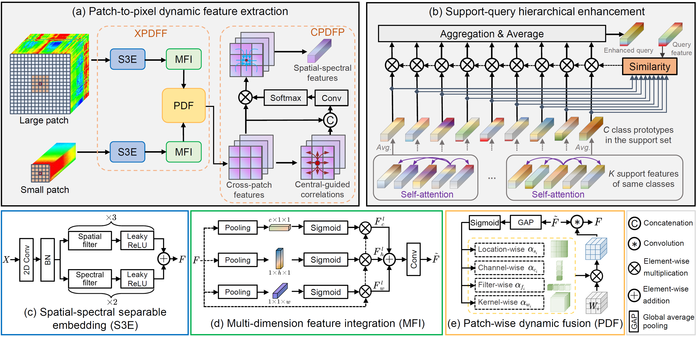

# Boosting Few-Shot Hyperspectral Image Classification Through Dynamic Fusion and Hierarchical Enhancement 【TNNLS2025】

Code for the paper: [Boosting Few-Shot Hyperspectral Image Classification Through Dynamic Fusion and Hierarchical Enhancement](https://ieeexplore.ieee.org/document/11194743).

<p align='center'>
  
</p>

## Abstract:
Few-shot learning has garnered increasing attention in hyperspectral image classification (HSIC) due to its potential to reduce dependency on labor-intensive and costly labeled data. However, most existing methods are constrained to feature extraction using a single image patch of fixed size, and typically neglect the pivotal role of the central pixel in feature fusion, leading to inefficient information utilization. In addition, the correlations among sample features have not been fully explored, thereby weakening feature expressiveness and hindering cross-domain knowledge transfer. To address these issues, we propose a novel few-shot HSIC framework incorporating dynamic fusion and hierarchical enhancement. Specifically, we first introduce a robust feature extraction module, which effectively combines the content concentration of small patches with the noise robustness of large patches, and further captures local spatial correlations through a central-pixel-guided dynamic pooling strategy. Such patch-to-pixel dynamic fusion enables a more comprehensive and robust extraction of ground object information. Then, we develop a support–query hierarchical enhancement module that integrates intraclass self-attention and interclass cross-attention mechanisms. This process not only enhances support-level and query-level feature representation but also facilitates the learning of more informative prior knowledge from the abundantly labeled source domain. Moreover, to further increase feature discriminability, we design an intraclass consistency loss and an interclass orthogonality loss, which collaboratively encourage intraclass samples to be closer together and interclass samples to be more separable in the metric space. Experimental results on four benchmark datasets demonstrate that our method substantially improves classification accuracy and consistently outperforms competing approaches.

## Citation

If you find the code useful for your research, please kindly cite:

[1] Y. Guo, B. Fan, Y. Feng, Y. Dai and M. He, "Boosting Few-Shot Hyperspectral Image Classification Through Dynamic Fusion and Hierarchical Enhancement," in IEEE Transactions on Neural Networks and Learning Systems, 2025, doi: 10.1109/TNNLS.2025.3615950.

```
@ARTICLE{11194743,
  author={Guo, Ying and Fan, Bin and Dai, Yuchao and Feng, Yan and He, Mingyi},
  journal={IEEE Transactions on Neural Networks and Learning Systems}, 
  title={Boosting Few-Shot Hyperspectral Image Classification Through Dynamic Fusion and Hierarchical Enhancement}, 
  year={2025},
  volume={},
  number={},
  pages={1-15},
  keywords={Feature extraction;Correlation;Accuracy;Hyperspectral imaging;Training;Image classification;Data mining;Metalearning;Three-dimensional displays;Knowledge transfer;Attention mechanism;dynamic fusion;few-shot learning (FSL);hyperspectral image classification (HSIC)},
  doi={10.1109/TNNLS.2025.3615950}}

```
## Datasets

```
├── Patch5_TRIAN_META_DATA_imdb_ocbs.pickle
├── Patch17_TRIAN_META_DATA_imdb_ocbs.pickle
├── test_ocbs
│   ├── PaviaU_data.mat
│   ├── PaviaU_gt.mat
└── train_ocbs
    ├── Botswana_data.mat
    ├── Botswana_gt.mat
    ├── Chikusei_data.mat
    ├── Chikusei_gt.mat
    ├── KSC_data.mat
    └── KSC_gt.mat
```
1) Please prepare the training and test data as operated in the paper. The used OCBS band selection method is referred to https://github.com/tanmlh.
2) Run "trainMetaDataProcess.py" to generate the meta-training data "Patch5_TRIAN_META_DATA_imdb_ocbs.pickle" and "Patch17_TRIAN_META_DATA_imdb_ocbs.pickle". And you can choose to download the meta-training data through Quark Netdisk (link:https://pan.quark.cn/s/47eeb0e98b00?pwd=7dwc)
3) Run "python DFHE.py".

Licensing
--
Copyright (C) 2025 Ying Guo

This program is free software: you can redistribute it and/or modify it under the terms of the GNU General Public License as published by the Free Software Foundation, version 3 of the License.

This program is distributed in the hope that it will be useful, but WITHOUT ANY WARRANTY; without even the implied warranty of MERCHANTABILITY or FITNESS FOR A PARTICULAR PURPOSE. See the GNU General Public License for more details.

You should have received a copy of the GNU General Public License along with this program.
